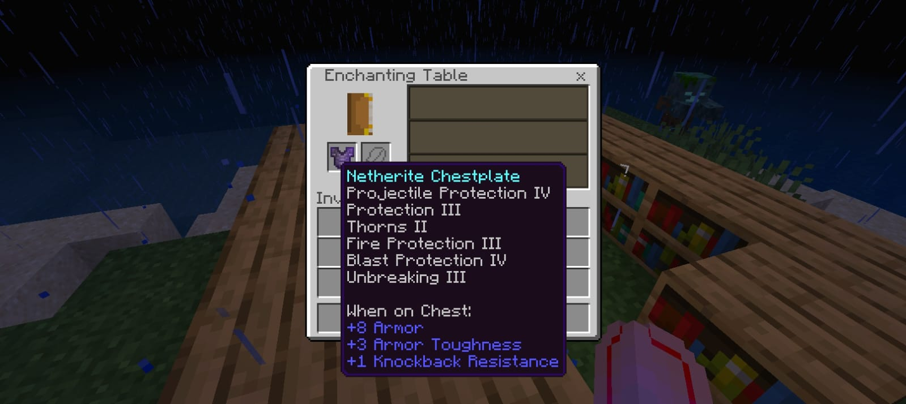

# ✨ EnchantUnbound

A lightweight mod that breaks the vanilla barriers, allowing you to create the ultimate god-tier gear. No more choosing between power and utility—have it all.

---

### 🛡️ Core Features
* **Ultimate Protection:** Stack Protection, Projectile Protection, Fire Protection, and Blast Protection all on one piece.
* **The Ultimate Sword:** Stack **Sharpness**, **Bane of Arthropods**, and **Smite** on a single sword.
* **The Enchantment Table:** Enchantment tables now grant these conflicting combinations of enchantments naturally.
* **Perfect Bows:** Put **Mending** and **Infinity** together on your bow, for true, Infinite Power.
* **OP Crossbows:** Combine **Piercing** and **Multishot** for ultimate crowd control.

---



---

### ⚠️ Useless Combinations
While you *can* put these together now, some enchants just don't work side-by-side. I have peronally tested every conflicting combination to ensure a perfect experience for Survival Players. To keep things stable, **the mod blocks these combinations from occurring:**

* **Fortune is disabled by Silk Touch:** You can't get extra drops from a block that hasn't been broken. Silk Touch takes priority, so your Fortune levels won't do anything.
* **Channeling is disabled by Riptide:** You can't strike a mob with lightning if you're busy launching yourself into the air.
* **Loyalty is disabled by Riptide:** There is no point in the trident "returning" to you if you never actually let go of it. 

---

### ⚙️ Total Freedom
If you prefer to have absolutely no restrictions at all—even for the combinations listed above—you can fork the mod and modify `Enchant_isCompatibleWith` in the main.cpp like this :

```c
bool Enchant_isCompatibleWith(void* a1, uint8_t ID) {
    return true;
}
```

## ⚙️ Requirements

- 🚀 [LeviLauncher](https://github.com/LiteLDev/LeviLaunchroid)

## 🛠️ Installation

- Install LeviLauncher
- Import EnchantUnbound mod in LeviLauncher by doing "Manage Mods > Add Mod"
- Launch Minecraft with the mod activated

## 📜 License
- This project is licensed under the GNU LGPL v3.0.
- It also uses the GlossHook library licensed under the MIT License.
- See the NOTICE file for details.
